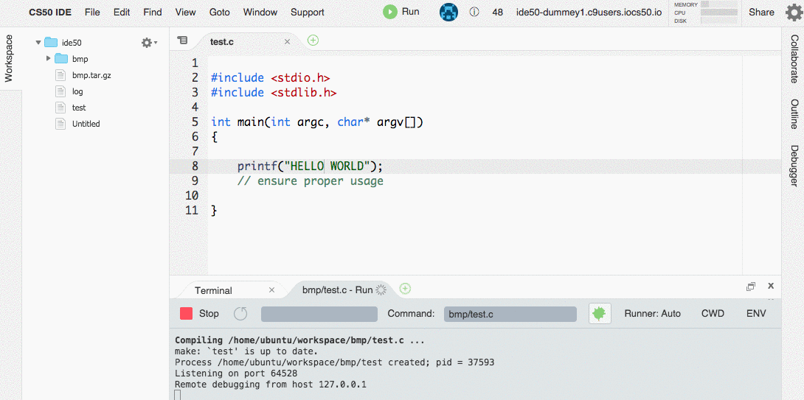

#Cloud9 Debugger Workarounds
Here are a list of problems and workarounds that have been discovered about the Cloud9 Debugger. The IDE is still in development and thus will have unexpected behavior. If something seems to be amiss and a reasonable solution can not be found in a reasonable time, please ask. 

##C GDB Runner is Missing
For an unknown reason, the configuration file (known as Runners) for C can go missing in some IDEs. This can be checked by clicking on 'Runner: ' in a debugger terminal:


If you **do not** see 'C (GDB Debugging)', you will need to manually add it by copying the below block and pasting it into a new Runner config. 

```
// For more information see http://docs.c9.io:8080/#!/api/run-method-run
// put me in .c9/runners/
{
  "cmd": [
    "sh",
    "-c",
    "/usr/bin/make $file_base_name && gdbserver --once :64528 $file_path/$file_base_name $args && echo '' || echo 'Please be sure to stop other debuggers before continuing.'"
  ],

  "info": "Compiling $file ...",
  "debugport": 64528,
  "debugger": "gdb",
  "executable": "$file_path/$file_base_name",
  "maxdepth": 50,
  "env": {},
  "selector": "^.*\\.c$"
}
```

This can be done by scrolling all the way down on the Runner list to 'New Runner'. Past the above config in, and save the file as something like 'my c runner.run'. This runner should then appear in your list. 


##Debugger Never Connects, Spinning Circle of Doom
After clicking the Debug button, the terminal area will activate, but is stuck on "Listening on port #####".


This is caused by a Node process from a previous debug session blocking the port from being used by the new debug session. To fix this, we have to kill the Node process. 

If you are comfortable with using the terminal, you can use: `killall node`

If not, you can use the 'Process List' in Cloud9 to find the Node process and kill them.



##Everything is Broken

If all else fails, have you tried turning it off and back on again? 

https://docs.c9.io/docs/restarting-your-workspace
